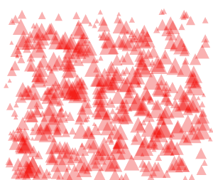

# look-at

Demonstrates using calculating and using the angle between two points. In this case, a set of triangles are positioned randomly and they rotate to follow the pointer. Rotation and positioning is accomplished via canvas transformations.

