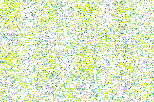

# particle-layout

Demonstrates animated particle layouts, adapted from [examples by Peter Beshai](https://bocoup.com/blog/smoothly-animate-thousands-of-points-with-html5-canvas-and-d3)

Uses:
* [Anime](http://animejs.com/documentation/#cssProperties) - Animation
* [Chroma](http://gka.github.io/chroma.js/) - Colour manipulation
