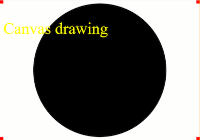

# starter

Sets up a canvas and demos drawing some basic shapes.

The drawing happens when the sketch loads, or if the window is resized. For an animated version (where drawing happens repeatedly), see [starter-animated](../starter-animated/).

# Read more

- [Canvas tutorial](https://developer.mozilla.org/en-US/docs/Web/API/Canvas_API/Tutorial)
