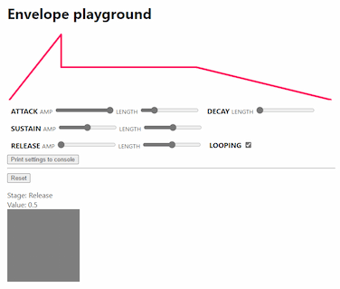

# Envelope Generator

See [Envelope Generator](Envelope%20Generator.md) for more information on the helper class.

## Try the demo

Move your pointer around the page. Notice how the width of the trail changes over time. Eventually it tapers off to a narrow tail, as if a brush is running out of paint. Pausing for a moment and then moving again resets the trail, almost like loading a brush with paint again.

## How it works

In short: an envelope is used to modulate the size of trail elements

The `pointermove` event is used to track pointer movements and move a red DIV (`#thing`) around the page. The last time of each movement is tracked, so the code can detect gaps in movements.

As the pointer moves, it also generates HTML elements which are inserted into a parent div (`#trails`). If the trail gets too long, the oldest elements are removed. As the element is created, its position is set to the pointer coordinate, and the size is determined by the envelope's current value.

When a gap in movement is detected, the envelope is reset so it goes to it's starting 'attack' stage.

## Things to change

* Change the parameters of the envelope and get a feel for how the trail changes.
* Try making an envelope in the [playground](playground.html) sketch and putting those values into the code.
* Tools like Photoshop have a 'jitter' setting, allowing blobs of paint to be randomly offset from the pointer location. Rather than adding uniform jitter, try using a second envelope to modulate the amount of jitter over the course of the movement

# Playground

The [playground](playground.html) sketch visualises the envelope shape and allows you to edit it live and see the results. Click 'Print settings to console' to get the parameters for the envelope you can use in your own code. 

Remember: the code for the playground is not meant to be built upon 

