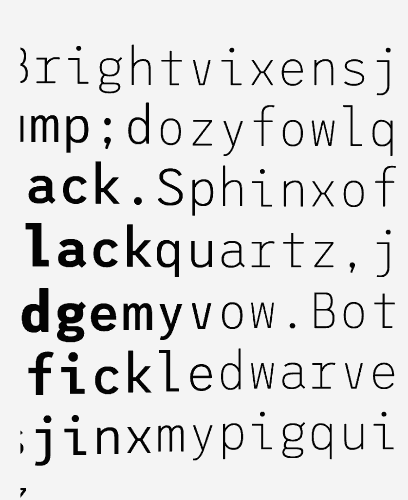

# track-letters

(please see variable\README.md for common tips + info)

This sketch combines the technique demonstrated in typography\lettering with font variation settings and 3D transforms.

The text is programmatically broken up into letters. As the pointer moves over the page, the relative distance from the letter and the cursor is used to change the rendering of the letter.

The font used does not vary in width as weight increases which produces a more pleasing result.

The sketch could be improved by calculating distance from the geometric centre of the letter, rather than just its top-left coordinate.

# Sources

- [League Mono typeface](http://tylerfinck.com/leaguemonovariable/) by Tyler Finck
